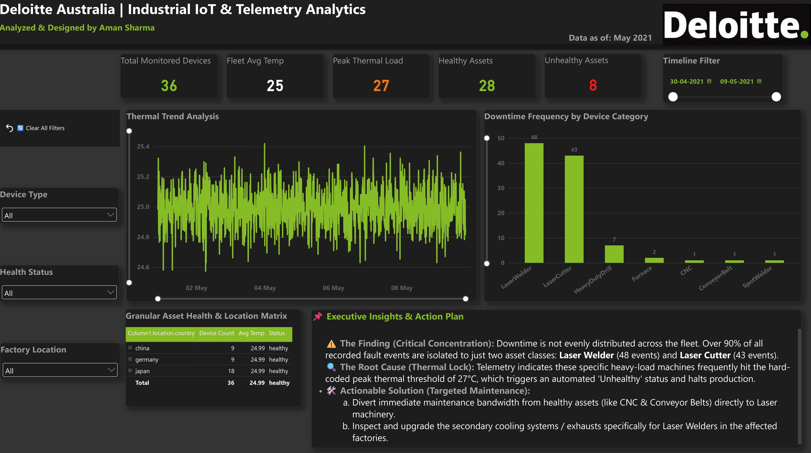

# 🏭 Deloitte Australia | Industrial IoT & Telemetry Analytics Dashboard

## 📌 Project Overview
An enterprise-grade Power BI dashboard designed to monitor factory asset health, thermal loads, and downtime frequency using simulated IoT telemetry data. The goal of this project is to transform raw sensor data into actionable maintenance strategies.

## 🚀 Key Features
*   **Executive Insights Panel:** Highlights critical findings (e.g., thermal locks in specific laser machinery) and provides a targeted action plan.
*   **Downtime Frequency Analysis:** Pivoted from standard temperature tracking to error-count analysis, instantly identifying the most failure-prone assets.
*   **Granular Drill-Down Matrix:** Allows deep-diving into specific factory locations and individual device health.
*   **Automated Navigation:** Features a custom 'Clear All Filters' bookmark button for seamless user experience.
*   **Dark Mode UI:** Designed with a premium 'Deloitte Green' and dark grey contrast for optimal readability and a "Control Room" aesthetic.

## 🛠️ Tech Stack
*   **Tool:** Power BI Desktop
*   **Skills:** Data Visualization, DAX, Custom Formatting, Bookmark Automation, UX/UI Design.

## 📊 Business Impact
By isolating the root cause of production halts (a 27°C thermal threshold), this dashboard enables maintenance teams to shift focus from healthy equipment (like CNCs or continuous slitting machines) directly to the overheating assets, significantly reducing overall factory downtime.
